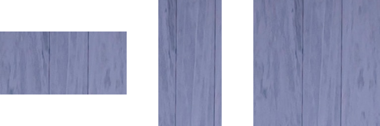

## Loading Images

### useImage

Images are loaded using the `useImage` hook. This hook returns an `SkImage` instance, which can be passed to the `Image` component.

Images can be loaded using require statements or by passing a network URL directly. It is also possible to load images from the app bundle using named images.

```tsx twoslash
import { useImage } from "@shopify/react-native-skia";
// Loads an image from the JavaScript bundle
const image1 = useImage(require("./assets/oslo"));
// Loads an image from the network
const image2 = useImage("https://picsum.photos/200/300");
// Loads an image that was added to the Android/iOS bundle
const image3 = useImage("Logo");
```

Loading an image is an asynchronous operation, so the `useImage` hook will return null until the image is fully loaded. You can use this behavior to conditionally render the `Image` component, as shown in the [example below](#example).

The hook also provides an optional error handler as a second parameter.

### MakeImageFromEncoded

You can also create image instances manually using `MakeImageFromEncoded`.

```tsx twoslash
import { Skia } from "@shopify/react-native-skia";

// A sample base64-encoded pixel
const data = Skia.Data.fromBase64(
  "iVBORw0KGgoAAAANSUhEUgAAAAEAAAABCAYAAAAfFcSJAAAADUlEQVR42mP8/5+hHgAHggJ/PchI7wAAAABJRU5ErkJggg=="
);
const image = Skia.Image.MakeImageFromEncoded(data);
```

### MakeImage

`MakeImage` allows you to create an image by providing pixel data and specifying the format.

```tsx twoslash
import { Skia, AlphaType, ColorType } from "@shopify/react-native-skia";

const pixels = new Uint8Array(256 * 256 * 4);
pixels.fill(255);
let i = 0;
for (let x = 0; x < 256; x++) {
  for (let y = 0; y < 256; y++) {
    pixels[i++] = (x * y) % 255;
  }
}
const data = Skia.Data.fromBytes(pixels);
const img = Skia.Image.MakeImage(
  {
    width: 256,
    height: 256,
    alphaType: AlphaType.Opaque,
    colorType: ColorType.RGBA_8888,
  },
  data,
  256 * 4
);
```

**Note**: The nested for-loops in the code sample above seem to have a mistake in the loop conditions. They should loop up to `256`, not `256 * 4`, as the pixel data array has been initialized with `256 * 256 * 4` elements representing a 256 by 256 image where each pixel is represented by 4 bytes (RGBA).

### useImage

`useImage` is simply a helper function to load image data.

## Image Component

Images can be drawn by specifying the output rectangle and how the image should fit into that rectangle.

| Name      | Type       | Description                                                                                                                                                                |
| :-------- | :--------- | :------------------------------------------------------------------------------------------------------------------------------------------------------------------------- |
| image     | `SkImage`  | An instance of the image.                                                                                                                                                  |
| x         | `number`   | The left position of the destination image.                                                                                                                                |
| y         | `number`   | The top position of the destination image.                                                                                                                                 |
| width     | `number`   | The width of the destination image.                                                                                                                                        |
| height    | `number`   | The height of the destination image.                                                                                                                                       |
| fit?      | `Fit`      | The method used to fit the image into the rectangle. Values can be `contain`, `fill`, `cover`, `fitHeight`, `fitWidth`, `scaleDown`, or `none` (the default is `contain`). |
| sampling? | `Sampling` | The method used to sample the image. see ([sampling options](/docs/images#sampling-options)).                                                                              |

### Example

```tsx twoslash
import { Canvas, Image, useImage } from "@shopify/react-native-skia";

const ImageDemo = () => {
  const image = useImage(require("./assets/oslo.jpg"));
  return (
    <Canvas style={{ flex: 1 }}>
      <Image image={image} fit="contain" x={0} y={0} width={256} height={256} />
    </Canvas>
  );
};
```

### Sampling Options

The `sampling` prop allows you to control how the image is sampled when it is drawn.
Use cubic sampling for best quality: you can use the default `sampling={CubicSampling}` (defaults to `{ B: 0, C: 0 }`) or any value you would like: `sampling={{ B: 0, C: 0.5 }}`.

You can also use filter modes (`nearest` or `linear`) and mimap modes (`none`, `nearest`, or `linear`). Default is `nearest`.

```tsx twoslash
import {
  Canvas,
  Image,
  useImage,
  CubicSampling,
  FilterMode,
  MipmapMode,
} from "@shopify/react-native-skia";

const ImageDemo = () => {
  const image = useImage(require("./assets/oslo.jpg"));
  return (
    <Canvas style={{ flex: 1 }}>
      <Image
        image={image}
        fit="contain"
        x={0}
        y={0}
        width={256}
        height={256}
        sampling={CubicSampling}
      />
      <Image
        image={image}
        fit="contain"
        x={0}
        y={0}
        width={256}
        height={256}
        sampling={{ filter: FilterMode.Nearest, mipmap: MipmapMode.Nearest }}
      />
    </Canvas>
  );
};
```

### fit="contain"


### fit="cover"


### fit="fill"


### fit="fitHeight"


### fit="fitWidth"


### fit="scaleDown"


### fit="none"



## Instance Methods

| Name             | Description                                                                |
| :--------------- | :------------------------------------------------------------------------- |
| `height`         | Returns the possibly scaled height of the image.                           |
| `width`          | Returns the possibly scaled width of the image.                            |
| `getImageInfo`   | Returns the image info for the image.                                      |
| `encodeToBytes`  | Encodes the image pixels, returning the result as a `UInt8Array`.          |
| `encodeToBase64` | Encodes the image pixels, returning the result as a base64-encoded string. |
| `readPixels`     | Reads the image pixels, returning result as UInt8Array or Float32Array     |

### Encoding options

Both encoding methods have the same arguments:

```ts
image.encodeToBytes(format?, quality?, lossless?);
image.encodeToBase64(format?, quality?, lossless?);
```

The default format is `ImageFormat.PNG`. The supported formats are
`ImageFormat.JPEG`, `ImageFormat.PNG`, and `ImageFormat.WEBP`.

#### Quality normalization

- Values below 0, including `-Infinity`, are normalized to 0.
- Values above 100, including `Infinity`, are normalized to 100.
- `undefined` and `NaN` select the format-specific default.
- `lossless` only applies to WebP. It is ignored for JPEG and PNG.

| Format | Default | Meaning of `quality` | Encoding mode |
| :----- | :------ | :------------------- | :------------ |
| JPEG | Quality 100 | Visual quality from 0 to 100 | Always lossy |
| PNG | zlib level 6 | Compression level `round(9 × (1 - quality / 100))` | Always lossless |
| WebP | Lossless, effort 75 | Visual quality in lossy mode; encoder effort in lossless mode | Selected by `lossless`, or inferred when omitted |

PNG does not define a standard `quality` parameter. When quality is omitted,
React Native Skia leaves Skia's PNG options unchanged, which uses the default
zlib compression level 6. An explicit quality of 0 maps to zlib level 9
(maximum compression), while 100 maps to level 0 (no zlib compression). This
changes encoding time and file size, but never the decoded pixels.

#### WebP lossy and lossless modes

**WebP defaults to lossless when both `quality` and `lossless` are omitted.**
This preserves the historical React Native Skia and CanvasKit behavior.

| Arguments after `ImageFormat.WEBP` | Result |
| :--------------------------------- | :----- |
| none, `undefined`, or `NaN` | Lossless WebP with effort 75 |
| `quality` from 0 through 99, no `lossless` flag | Lossy WebP at that visual quality |
| `quality` 100, no `lossless` flag | Lossless WebP with effort 75 |
| `undefined, false` | Lossy WebP at quality 100 |
| `quality, false` | Lossy WebP at the normalized visual quality |
| `undefined, true` | Lossless WebP with effort 100 |
| `quality, true` | Lossless WebP at the normalized encoder effort |

In lossless WebP mode, quality does not affect pixels. It controls encoder
effort: lower values encode faster into larger files, while higher values encode
slower into smaller files. Consequently, automatic WebP at quality 100 uses the
legacy effort 75, while explicitly passing `true` at quality 100 uses effort
100 and may produce different bytes.

#### Examples

```tsx twoslash
import { ImageFormat, Skia } from "@shopify/react-native-skia";

const surface = Skia.Surface.MakeOffscreen(64, 64)!;
const image = surface.makeImageSnapshot();

// PNG
image.encodeToBytes(); // Default format: lossless PNG, zlib level 6
image.encodeToBytes(ImageFormat.PNG, 0); // Lossless PNG, zlib level 9
image.encodeToBytes(ImageFormat.PNG, 100); // Lossless PNG, zlib level 0

// JPEG
image.encodeToBytes(ImageFormat.JPEG); // Lossy JPEG, quality 100
image.encodeToBytes(ImageFormat.JPEG, 80); // Lossy JPEG, quality 80

// WebP with the legacy automatic mode
image.encodeToBytes(ImageFormat.WEBP); // Lossless, effort 75
image.encodeToBytes(ImageFormat.WEBP, 80); // Lossy, quality 80
image.encodeToBytes(ImageFormat.WEBP, 100); // Lossless, effort 75

// WebP with an explicit mode
image.encodeToBytes(ImageFormat.WEBP, 80, true); // Lossless, effort 80
image.encodeToBytes(ImageFormat.WEBP, 100, false); // Lossy, quality 100
image.encodeToBytes(ImageFormat.WEBP, undefined, true); // Lossless, effort 100
image.encodeToBytes(ImageFormat.WEBP, undefined, false); // Lossy, quality 100

// The same options are available for base64 output
image.encodeToBase64(ImageFormat.WEBP, 85, false);
```
