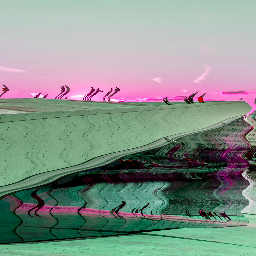

Skia provides a shading language.
You can play with it [here](https://shaders.skia.org/).
The syntax is very similar to GLSL.
If you're already familiar with GLSL, or are looking to convert a GLSL shader to SKSL, you can view a list of their differences [here](https://github.com/google/skia/tree/main/src/sksl#readme).

The first step is to create a shader and compile it using `RuntimeEffect.Make`.

```tsx twoslash
import {Skia} from "@shopify/react-native-skia";

const source = Skia.RuntimeEffect.Make(`
vec4 main(vec2 pos) {
  // The canvas is 256x256
  vec2 canvas = vec2(256);
  // normalized x,y values go from 0 to 1
  vec2 normalized = pos/canvas;
  return vec4(normalized.x, normalized.y, 0.5, 1);
}`);

if (!source) {
  throw new Error("Couldn't compile the shader")
}
```

## Shader

Creates a shader from source.
Shaders can be nested with one another.

| Name     | Type                                                                                                    |  Description                  |
|:---------|:--------------------------------------------------------------------------------------------------------|:------------------------------|
| source   | `RuntimeEffect`                                                                                         | Compiled shaders              |
| uniforms | <code>{ [name: string]: number &#124; Vector &#124; Vector[] &#124; number[] &#124; number[][] }</code> | uniform values                |
| children | `Shader`                                                                                                | Shaders to be used as uniform |

### Simple Shader

```tsx twoslash
import {Skia, Canvas, Shader, Fill} from "@shopify/react-native-skia";

const source = Skia.RuntimeEffect.Make(`
vec4 main(vec2 pos) {
  // normalized x,y values go from 0 to 1, the canvas is 256x256
  vec2 normalized = pos/vec2(256);
  return vec4(normalized.x, normalized.y, 0.5, 1);
}`)!;

const SimpleShader = () => {
  return (
    <Canvas style={{ width: 256, height: 256 }}>
      <Fill>
        <Shader source={source} />
      </Fill>
    </Canvas>
  );
};
```


### Using Uniforms

Uniforms are variables used to parametrize shaders.
The following uniform types are supported: `float`, `float2`, `float3`, `float4`, `float2x2`, `float3x3`, `float4x4`, `int`, `int2`, `int3` and, `int4`.
The types can also be used as arrays, e.g. `uniform float3 colors[12]`. 

```tsx twoslash
import {Canvas, Skia, Shader, Fill, vec} from "@shopify/react-native-skia";

const source = Skia.RuntimeEffect.Make(`
uniform vec2 c;
uniform float r;
uniform float blue;

vec4 main(vec2 pos) {
  vec2 normalized = pos/vec2(2 * r);
  return distance(pos, c) > r ? vec4(1) : vec4(normalized, blue, 1);
}`)!;

const UniformShader = () => {
  const r = 128;
  const c = vec(2 * r, r);
  const blue = 1.0;
  return (
    <Canvas style={{ width: 256, height: 256 }}>
      <Fill>
        <Shader source={source} uniforms={{ c, r, blue }} />
      </Fill>
    </Canvas>
  );
};
```


### Nested Shaders

```tsx twoslash
import {Canvas, Skia, ImageShader, Shader, Fill, useImage} from "@shopify/react-native-skia";

const source = Skia.RuntimeEffect.Make(`
uniform shader image;

half4 main(float2 xy) {   
  xy.x += sin(xy.y / 3) * 4;
  return image.eval(xy).rbga;
}`)!;

const NestedShader = () => {
  const image = useImage(require("./assets/oslo.jpg"));
  if (!image) {
    return null;
  }
  return (
    <Canvas style={{ width: 256, height: 256 }}>
      <Fill>
        <Shader source={source}>
          <ImageShader
            image={image}
            fit="cover"
            rect={{ x: 0, y: 0, width: 256, height: 256 }}
          />
        </Shader>
      </Fill>
    </Canvas>
  );
};
```


