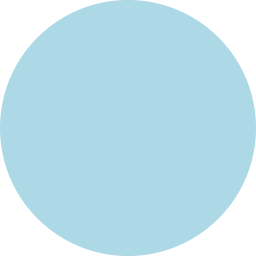

## Circle

Draws a circle.

| Name | Type     |  Description     |
|:-----|:---------|:-----------------|
| cx   | `number` | Start point.     |
| cy   | `number` | End point.       |
| r    | `number` | Radius.          |

```tsx twoslash
import {Canvas, Circle} from "@exodus/react-native-skia";

const CircleDemo = () => {
  const r = 128;
  return (
    <Canvas style={{ flex: 1 }}>
      <Circle cx={r} cy={r} r={r} color="lightblue" />
    </Canvas>
  );
};
```




## Oval

Draws an oval based on its bounding rectangle.

| Name   | Type     |  Description                                |
|:-------|:---------|:--------------------------------------------|
| x      | `number` | X coordinate of the bounding rectangle.     |
| y      | `number` | Y coordinate of the bounding rectangle.     |
| width  | `number` | Width of the bounding rectangle.            |
| height | `number` | Height of the bounding rectangle.           |


```tsx twoslash
import {Canvas, Oval} from "@exodus/react-native-skia";

const OvalDemo = () => {
  return (
    <Canvas style={{ flex: 1 }}>
      <Oval x={64} y={0} width={128} height={256} color="lightblue" />
    </Canvas>
  );
};
```


