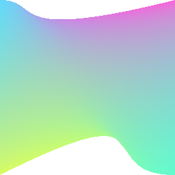

Draws a [Coons patch](https://en.wikipedia.org/wiki/Coons_patch).

| Name      | Type      |  Description                                                  |
|:----------|:----------|:--------------------------------------------------------------|
| cubics | `CubicBezier[4]` | Specifies four cubic Bezier starting at the top-left corner, in clockwise order, sharing every fourth point. The last cubic Bezier ends at the first point. |
| textures   | `Point[]`.   | [Texture mapping](https://en.wikipedia.org/wiki/Texture_mapping). The texture is the shader provided by the paint |
| colors?    | `string[]`   | Optional colors to be associated to each corner |
| blendMode? | `BlendMode`  | If `colors` is provided, colors are blended with the paint using the blend mode. Default is `dstOver` if colors are provided, `srcOver` if not |

## Example

```tsx twoslash
import {Canvas, Patch, vec} from "@exodus/react-native-skia";

const PatchDemo = () => {
  const colors = ["#61dafb", "#fb61da", "#61fbcf", "#dafb61"];
  const C = 64;
  const width = 256;
  const topLeft = { pos: vec(0, 0), c1: vec(0, C), c2: vec(C, 0) };
  const topRight = {
    pos: vec(width, 0),
    c1: vec(width, C),
    c2: vec(width + C, 0),
  };
  const bottomRight = {
    pos: vec(width, width),
    c1: vec(width, width - 2 * C),
    c2: vec(width - 2 * C, width),
  };
  const bottomLeft = {
    pos: vec(0, width),
    c1: vec(0, width - 2 * C),
    c2: vec(-2 * C, width),
  };
  return (
    <Canvas style={{ flex: 1 }}>
      <Patch
        colors={colors}
        patch={[topLeft, topRight, bottomRight, bottomLeft]}
      />
    </Canvas>
  );
};
```

