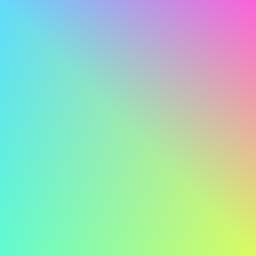

Draws vertices.

| Name       | Type         | Description              |
| :--------- | :----------- | :----------------------- |
| vertices   | `Point[]`    | Vertices to draw |
| mode?      | `VertexMode` | Can be `triangles`, `triangleStrip` or `triangleFan`. Default is `triangles` |
| indices?   | `number[]`   | Indices of the vertices that form the triangles. If not provided, the order of the vertices will be taken. Using this property enables you not to duplicate vertices. |
| textures   | `Point[]`.   | [Texture mapping](https://en.wikipedia.org/wiki/Texture_mapping). The texture is the shader provided by the paint. |
| colors?    | `string[]`   | Optional colors to be associated to each vertex |
| blendMode? | `BlendMode`  | If `colors` is provided, colors are blended with the paint using the blend mode. Default is `dstOver` if colors are provided, `srcOver` if not. |

## Using texture mapping

```tsx twoslash
import { Canvas, Group, ImageShader, Vertices, vec, useImage } from "@exodus/react-native-skia";

const VerticesDemo = () => {
  const image = useImage(require("./assets/squares.png"));
  const vertices = [vec(64, 0), vec(128, 256), vec(0, 256)];
  const colors = ["#61dafb", "#fb61da", "#dafb61"];
  const textures = [vec(0, 0), vec(0, 128), vec(64, 256)];
  if (!image) {
    return null;
  }
  return (
    <Canvas style={{ flex: 1 }}>
      {/* This is our texture */}
      <Group>
        <ImageShader
          image={image}
          tx="repeat"
          ty="repeat"
        />
        {/* Here we specified colors, the default blendMode is dstOver */}
        <Vertices vertices={vertices} colors={colors} />
        <Group transform={[{ translateX: 128 }]}>
          {/* Here we didn't specify colors, the default blendMode is srcOver */}
          <Vertices vertices={vertices} textures={textures} />
        </Group>
      </Group>
    </Canvas>
  );
};
```


## Using indices

In the example below, we defined four vertices, representing four corners of a rectangle.
Then we use the indices property to define the two triangles we would like to draw based on these four vertices.
* First triangle: `0, 1, 2` (top-left, top-right, bottom-right).
* Second triangle: `0, 2, 3` (top-left, bottom-right, bottom-left).

```tsx twoslash
import { Canvas, Vertices, vec } from "@exodus/react-native-skia";

const IndicesDemo = () => {
  const vertices = [vec(0, 0), vec(256, 0), vec(256, 256), vec(0, 256)];
  const colors = ["#61DAFB", "#fb61da", "#dafb61", "#61fbcf"];
  const triangle1 = [0, 1, 2];
  const triangle2 = [0, 2, 3];
  const indices = [...triangle1, ...triangle2];
  return (
    <Canvas style={{ flex: 1 }}>
      <Vertices vertices={vertices} colors={colors} indices={indices} />
    </Canvas>
  );
};
```


