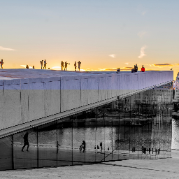
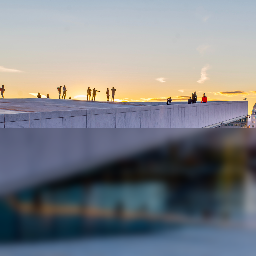

In Skia, backdrop filters are equivalent to their [CSS counterpart](https://developer.mozilla.org/en-US/docs/Web/CSS/backdrop-filter). They allow you to apply image filters such as blurring to the area behind a [clipping mask](/docs/group#clipping-operations). A backdrop filter extends the [Group component](/docs/group#clipping-operations). All properties from the [group component](/docs/group) can be applied to a backdrop filter.

## Backdrop Filter
Applies an image filter to the area behind the whole canvas or behind a defined clipping mask. The first child of a backdrop filter is the image filter to apply. All properties from the [group component](/docs/group) can be applied to a backdrop filter.

### Example

Apply a black and white color matrix to the clipping area

```tsx twoslash
import { Canvas, BackdropFilter, Fill, Image, ColorMatrix, useImage } from "@shopify/react-native-skia";

// https://kazzkiq.github.io/svg-color-filter/
const BLACK_AND_WHITE = [
  0, 1, 0, 0, 0, 0, 1, 0, 0, 0, 0, 1, 0, 0, 0, 0, 1, 0, 1, 0,
];

const Filter = () => {
  const image = useImage(require("./assets/oslo.jpg"));
  if (!image) {
    return null;
  }
  return (
    <Canvas style={{ width: 256, height: 256 }}>
      <Image
        image={image}
        x={0}
        y={0}
        width={256}
        height={256}
        fit="cover"
      />
      <BackdropFilter clip={{ x: 0, y: 128, width: 256, height: 128 }}>
        <ColorMatrix matrix={BLACK_AND_WHITE} />
      </BackdropFilter>
    </Canvas>
  );
};
```



## Backdrop Blur

Creates a backdrop blur. All properties from the [group component](/docs/group) can be applied to a backdrop filter.

| Name      | Type                |  Description                                             |
|:----------|:--------------------|:---------------------------------------------------------|
| blur      | `number`            | Blur radius                                              |

## Example

```tsx twoslash
import { Canvas, Fill, Image, BackdropBlur, ColorMatrix, useImage } from "@shopify/react-native-skia";

const Filter = () => {
  const image = useImage(require("./assets/oslo.jpg"));
  if (!image) {
    return null;
  }
  return (
    <Canvas style={{ width: 256, height: 256 }}>
      <Image
        image={image}
        x={0}
        y={0}
        width={256}
        height={256}
        fit="cover"
      />
      <BackdropBlur
        blur={4}
        clip={{ x: 0, y: 128, width: 256, height: 128 }}
      >
        <Fill color="rgba(0, 0, 0, 0.2)" />
      </BackdropBlur>
    </Canvas>
  );
};
```

