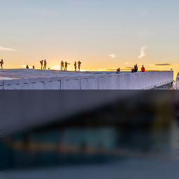

## Backdrop Blur

Creates a backdrop blur

| Name      | Type                |  Description                                             |
|:----------|:--------------------|:---------------------------------------------------------|
| clip      | `RectOrRRectOrPath` | Rectangle, rounded rectangle, or Path to use as backdrop |
| intensity | `number`            | intensity of the blur                                    |
| color?    | `string`            | Optional semi-transparent color to fill the clip with    |

## Example

```tsx twoslash
import {Canvas, Image, BackdropBlur, useImage} from "@shopify/react-native-skia";

export const BackdropDemo = () => {
  const image = useImage(require("./assets/oslo.jpg"));
  if (!image) {
    return null;
  }
  return (
    <Canvas style={{ flex: 1 }}>
      <Image
        image={image}
        x={0}
        y={0}
        width={256}
        height={256}
        fit="cover"
      />
      <BackdropBlur
        intensity={4}
        color="rgba(0, 0, 0, 0.5)"
        clip={{ x: 0, y: 128, width: 256, height: 128 }}
      />
    </Canvas>
  );
};
```

