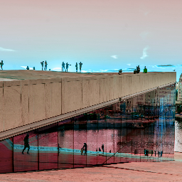

## Color Matrix

Creates a color filter using the provided color matrix.
A playground to build color matrices is available [here](https://fecolormatrix.com/). 

| Name       | Type          |  Description                               |
|:-----------|:--------------|:-------------------------------------------|
| value      | `number[]`    | Color Matrix (5x4)                         |
| children?  | `ColorFilter` | Optional color filter to be applied first. |

```tsx twoslash
import { Canvas, Paint, ColorMatrix, Image } from "@shopify/react-native-skia";

const MatrixColorFilter = () => {
  return (
    <Canvas style={{ flex: 1 }}>
      <Paint>
        <ColorMatrix
          value={[
            -0.578, 0.99, 0.588, 0, 0, 0.469, 0.535, -0.003, 0, 0, 0.015,
            1.69, -0.703, 0, 0, 0, 0, 0, 1, 0,
          ]}
        />
      </Paint>
      <Image
        x={0}
        y={0}
        width={256}
        height={256}
        source={require("./assets/oslo.jpg")}
        fit="cover"
      />
    </Canvas>
  );
};
```



## Blend

Creates a color filter with the given color and blend mode.

| Name       | Type          |  Description                                      |
|:-----------|:--------------|:--------------------------------------------------|
| color      | `Color`       | Color                                             |
| mode       | `BlendMode`   | see [blend modes](paint/properties.md#blend-mode).|
| children?  | `ColorFilter` | Optional color filter to be applied first.        |

## Lerp

Creates a color filter that is linearly interpolated between two other color filters.

| Name      | Type          |  Description                               |
|:----------|:--------------|:-------------------------------------------|
| t         | `number`      | Value between 0 and 1.                     |
| children  | `ColorFilter` | The two color filters to interpolate from. |

## LinearToSRGBGamma

Creates a color filter that converts between linear colors and sRGB colors.

| Name       | Type          |  Description                                      |
|:-----------|:--------------|:--------------------------------------------------|
| children?  | `ColorFilter` | Optional color filter to be applied first.        |

## SRGBToLinearGamma

Creates a color filter that converts between sRGB colors and linear colors.

| Name       | Type          |  Description                                      |
|:-----------|:--------------|:--------------------------------------------------|
| children?  | `ColorFilter` | Optional color filter to be applied first.        |