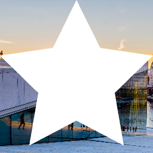
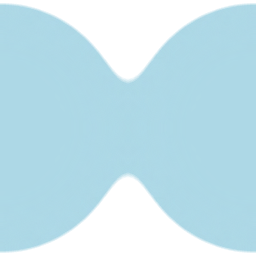

The Group component is an important construct in React Native Skia.
Group components can be deeply nested with one another.
It can apply the following operations to its children:
* [Paint properties](#paint-properties)
* [Transformations](#transformation)
* [Clipping operations](#clipping-operations)
* [Bitmap Effects](#bitmap-effects)

| Name       | Type               |  Description                                                  |
|:-----------|:-------------------|:--------------------------------------------------------------|
| transform? | `Transform2d`      | [Same API than in React Native](https://reactnative.dev/docs/transforms). The default origin of the transformation is however different. It is the center object in React Native and the top-left corner in Skia. |
| origin?    | `Point`            | Sets the origin of the transformation. This property is not inherited by its children. |
| clipRect?   | `RectOrRRect`     | Rectangle or rounded rectangle to use to clip the children. |
| clipPath?   | `Path or string`  | Path to use to clip the children |
| invertClip? | `boolean`         | Invert the clipping region: parts outside the clipping region will be shown and, inside will be hidden. |
| rasterize? | `RefObject<Paint>` | Draws the children as a bitmap and apply the effects provided by the paint. |

## Paint Properties

All paint properties applied to a group will be inherited by its children.

```tsx twoslash
import {Canvas, Circle, Paint, Group} from "@shopify/react-native-skia";
 
export const PaintDemo = () => {
  const r = 128;
  return (
    <Canvas style={{ flex: 1 }}>
      <Circle cx={r} cy={r} r={r} color="#51AFED" />
      {/* The paint is inherited by the following sibling and descendants. */}
      <Group color="lightblue" style="stroke" strokeWidth={10}>
        <Circle cx={r} cy={r} r={r / 2} />
        <Circle cx={r} cy={r} r={r / 3} color="white" />
      </Group>
    </Canvas>
  );
};
```


## Transformations

The transform property is identical to its [homonymous property in React Native](https://reactnative.dev/docs/transforms) except for one major difference: in React Native the origin of transformation is the center of the object whereas it is the top left position of the object in Skia.

The origin property is an helper to set the origin of the transformation. This property is not inherited by its children.

### Simple Transformation

```tsx twoslash
import {Canvas, Fill, Group, Rect} from "@shopify/react-native-skia";

const SimpleTransform = () => {
  return (
    <Canvas style={{ flex: 1 }}>
      <Fill color="#e8f4f8" />
      <Group color="lightblue" transform={[{ skewX: Math.PI / 6 }]}>
        <Rect x={64} y={64} width={128} height={128} rx={10} />
      </Group>
    </Canvas>
  );
};
```


### Transformation of Origin

```tsx twoslash
import {Canvas, Fill, Group, Rect} from "@shopify/react-native-skia";

const SimpleTransform = () => {
  return (
    <Canvas style={{ flex: 1 }}>
      <Fill color="#e8f4f8" />
      <Group
        color="lightblue"
        origin={{ x: 128, y: 128 }}
        transform={[{ skewX: Math.PI / 6 }]}
      >
        <Rect x={64} y={64} width={128} height={128} rx={10} />
      </Group>
    </Canvas>
  );
};
```


## Clipping Operations

`clipRect` or `clipPath` provide a clipping region that sets what part of the children should be shown.
Parts that are inside the region are shown, while those outside are hidden. Using `invertClip`, parts outside the clipping region will be shown and parts inside will be hidden.

### Clip Path

```tsx twoslash
import {Canvas, Group, Image} from "@shopify/react-native-skia";

const Clip = () => {
  const star =
    "M128 0L167.552 80.128L256 93.056L192 155.392L207.104 243.456L128 201.856L48.896 243.456L64 155.392L0 93.056L88.448 80.128L128 0Z";
  return (
    <Canvas style={{ flex: 1 }}>
      <Group clipPath={star}>
        <Image
          source={require("./assets/oslo.jpg")}
          x={0}
          y={0}
          width={256}
          height={256}
          fit="cover"
        />
      </Group>
    </Canvas>
  );
};
```


### Invert Clip

```tsx twoslash
import {Canvas, Group, Image} from "@shopify/react-native-skia";

const Clip = () => {
  const star =
    "M128 0L167.552 80.128L256 93.056L192 155.392L207.104 243.456L128 201.856L48.896 243.456L64 155.392L0 93.056L88.448 80.128L128 0Z";
  return (
    <Canvas style={{ flex: 1 }}>
      <Group clipPath={star} invertClip>
        <Image
          source={require("./assets/oslo.jpg")}
          x={0}
          y={0}
          width={256}
          height={256}
          fit="cover"
        />
      </Group>
    </Canvas>
  );
};
```



## Bitmap Effects

Using the `rasterize` property will create a bitmap drawing of the children to which you can apply effects.
This is particularly useful to build effects that need to be applied to a group of elements and not one in particular.

```tsx twoslash
import {Canvas, Group, Circle, Blur, Defs, Paint, ColorMatrix, usePaintRef} from "@shopify/react-native-skia";

const Clip = () => {
  const paint = usePaintRef();
  return (
    <Canvas style={{ flex: 1 }}>
      {/* Here we use <Defs /> so the paint is not used by the siblings and descendants */}
      <Defs>
        <Paint ref={paint}>
          <ColorMatrix
            value={[
              1, 0, 0, 0, 0, 0, 1, 0, 0, 0, 0, 0, 1, 0, 0, 0, 0, 0, 18, -7,
            ]}
          >
            <Blur sigmaX={20} sigmaY={20} />
          </ColorMatrix>
        </Paint>
      </Defs>
      <Group color="lightblue" rasterize={paint}>
        <Circle cx={0} cy={128} r={128 * 0.95} />
        <Circle
          cx={256}
          cy={128}
          r={128 * 0.95}
        />
      </Group>
    </Canvas>
  );
};
```


