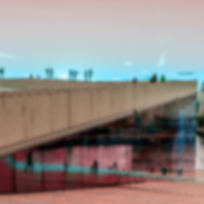

Image filters are effects that operate on all the color bits of pixels that make up an image.

## Blur

Creates an image filter that blurs its input by the separate X and Y sigmas.
The provided tile mode is used when the blur kernel goes outside the input image.

| Name      | Type          |  Description                                                  |
|:----------|:--------------|:--------------------------------------------------------------|
| sigmaX    | `number`      | The Gaussian sigma blur value along the X axis.       |
| sigmaY    | `number`      | The Gaussian sigma blur value along the Y axis.       |
| mode?     | `TileMode`    | `mirror`, `repeat`, `clamp`, or `decal` (default is `decal`). |
| children? | `ImageFilter` | Optional image filter to be applied first.                    | 

## Simple Blur

```tsx twoslash
import { Canvas, Paint, Blur, Image, useImage } from "@shopify/react-native-skia";

const BlurImageFilter = () => {
  const image = useImage(require("./assets/oslo.jpg"));
  if (!image) {
    return null;
  }
  return (
    <Canvas style={{ flex: 1 }}>
      <Paint>
        <Blur sigmaX={4} sigmaY={4} />
      </Paint>
      <Image
        x={0}
        y={0}
        width={256}
        height={256}
        image={image}
        fit="cover"
      />
    </Canvas>
  );
};
```


### With mode="clamp"


### Composing Filters

```tsx twoslash
import { Canvas, Paint, Blur, Image, ColorMatrix, useImage } from "@shopify/react-native-skia";

const ComposeImageFilter = () => {
  const image = useImage(require("./assets/oslo.jpg"));
  if (!image) {
    return null;
  }
  return (
    <Canvas style={{ flex: 1 }}>
      <Paint>
        <Blur sigmaX={2} sigmaY={2} mode="clamp">
          <ColorMatrix
            matrix={[
              -0.578, 0.99, 0.588, 0, 0, 0.469, 0.535, -0.003, 0, 0, 0.015,
              1.69, -0.703, 0, 0, 0, 0, 0, 1, 0,
            ]}
          />
        </Blur>
      </Paint>
      <Image
        x={0}
        y={0}
        width={256}
        height={256}
        image={image}
        fit="cover"
      />
    </Canvas>
  );
};
```


