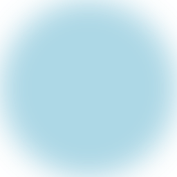
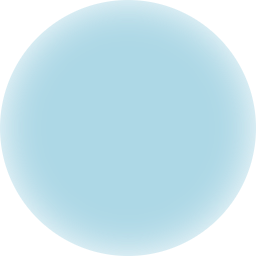
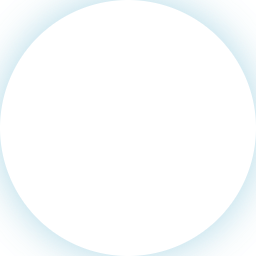

Mask filters are effects that manipulate the geometry and alpha channel of graphical objects. 

## BlurMask

Creates a blur mask filter.

| Name        | Type        |  Description                                          |
|:------------|:------------|:------------------------------------------------------|
| blur        | `number`    | Standard deviation of the Gaussian blur. Must be > 0. |
| style?      | `BlurStyle` | Can be `normal`, `solid`, `outer`, or `inner` (default is `normal`).        |
| respectCTM? | `boolean`   | if true the blur's sigma is modified by the CTM (default is `false`).      |

### Example

```tsx twoslash
import {Canvas, Fill, Circle, BlurMask, vec} from "@shopify/react-native-skia";

const MaskFilterDemo = () => {
  return (
    <Canvas style={{ flex: 1}}>
      <Circle c={vec(128)} r={128} color="lightblue">
        <BlurMask blur={20} style="normal" />
      </Circle>
    </Canvas>
  );
};
```

| Style  |  Result                           |       |                                  |
|:-------|:----------------------------------|:----- |:---------------------------------|
| normal |  | inner |   |
| solid  |    | outer |   |

