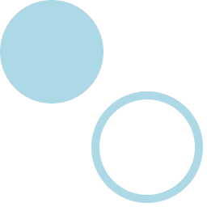
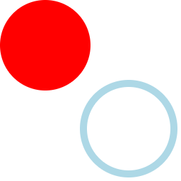
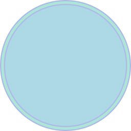

Anytime you draw something in Skia, and want to specify what color it is, or how it blends with the background, or what style to draw it in, you specify those attributes in a paint. In React Native Skia, there are many ways to specify a paint which are covering below.

The following properties to the Paint component:
* [color](properties.md#color)            
* [blendMode](properties.md#blendMode)     
* [style](properties.md#style)             
* [strokeWidth](properties.md#strokeWidth) 
* [strokeJoin](properties.md#strokeJoin)   
* [strokeCap](properties.md#strokeCap)     
* [strokeMiter](properties.md#strokeMiter) 
* [opacity](properties.md#opacity)      

A paint component can additionnaly receive the following components as children:
* [Shaders](/docs/shaders/overview) 
* [Image Filters](/docs/image-filters)
* [Color Filters](/docs/color-filters)
* [Mask Filters](/docs/mask-filters)
* [Path Effects](/docs/path-effects)

The paint component is inherited by the following sibling and descendants.
In the example below, the first circle will be filled with red and the second circle will have a light blue stroke.  

```tsx twoslash
import {Canvas, Circle, Paint, Group} from "@shopify/react-native-skia";

export const PaintDemo = () => {
  const r = 128;
  return (
    <Canvas style={{ flex: 1 }}>
      <Paint color="lightblue" />
      <Circle cx={r} cy={r} r={r} />
      {/* The paint is inherited by the following sibling and descendants. */}
      <Group style="stroke" strokeWidth={10}>
        <Circle cx={3 * r} cy={3 * r} r={r} />
      </Group>
    </Canvas>
  );
};
```



Alternatively, properties of a paint component can be assigned a shape directly.
If you assign these properties to a Group component, these properties will be inherited by children.
The example below produces the same result as above.

```tsx twoslash
import {Canvas, Circle, Group} from "@shopify/react-native-skia";

export const PaintDemo = () => {
  const r = 128;
  return (
    <Canvas style={{ flex: 1 }}>
      <Circle color="red" cx={r} cy={r} r={r} />
      {/* The paint is inherited by the following sibling and descendants. */}
      <Group color="lightblue" style="stroke" strokeWidth={10}>
        <Circle cx={3 * r} cy={3 * r} r={r} />
      </Group>
    </Canvas>
  );
};
```



You can also use the Paint component as child of a Shape.
This is useful if you want to draw a shape with many different fills and strokes.

```tsx twoslash
import {Canvas, Circle, Paint} from "@shopify/react-native-skia";

export const PaintDemo = () => {
  const strokeWidth = 10;
  const r = 128 - strokeWidth / 2;
  return (
    <Canvas style={{ flex: 1 }}>
       <Circle cx={r + strokeWidth / 2} cy={r} r={r} color="red">
        <Paint color="lightblue" />
        <Paint color="#adbce6" style="stroke" strokeWidth={strokeWidth} />
        <Paint color="#ade6d8" style="stroke" strokeWidth={strokeWidth / 2} />
      </Circle>
    </Canvas>
  );
};
```



Finally, we can can assign a ref to a Paint component for later use.
There a few use-cases where this is useful.
By wrapping the Paint component into a Defs component, we make sure that the paint is not used automatically by the renderer: need to pass the paint explicitly as a property.

```tsx twoslash
import {Canvas, Circle, Paint, Defs, usePaintRef} from "@shopify/react-native-skia";

export const PaintDemo = () => {
  const paint = usePaintRef();
  return (
    <Canvas style={{ flex: 1 }}>
        {/* The Defs component prevents the Paint from being used directly */}
        <Defs>
          <Paint ref={paint} color="lightblue" />
        </Defs>
        {/* We can assign the ref to any shape. This will be handy in advanced use-case */}
        <Circle paint={paint} cx={128} cy={128} r={128} />
    </Canvas>
  );
};
```

:::tip

When using the Paint component, you always start from scratch.
It doesn't inherit the properties of the paint available in the current context.

:::