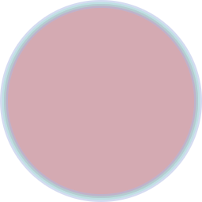

Below are the properties of a Paint component.
The following children can also be assigned to a Paint:
* [Shaders](/docs/shaders/overview) 
* [Image Filters](/docs/image-filters)
* [Color Filters](/docs/color-filters)
* [Mask Filters](/docs/mask-filters)
* [Path Effects](/docs/path-effects)

## Color

Sets alpha and RGB used when stroking and filling.
The color is a string or a number.

```tsx twoslash
import {Paint} from "@shopify/react-native-skia";

<>
  <Paint color="red" />
  {/* 0xffff0000 is also red (format is argb) */}
  <Paint color={0xffff0000} />
</>
```

## Opacity

Replaces alpha, leaving RGBA unchanged. 0 means fully transparent, 1.0 means opaque.
When setting opacity in a Group component, the alpha component of all descending colors will inherit that value.

```tsx twoslash
import {Canvas, Circle, Group, Paint} from "@shopify/react-native-skia";

export const OpacityDemo = () => {
  const strokeWidth = 10;
  const r = 128 - strokeWidth / 2;
  return (
    <Canvas style={{ flex: 1 }}>
      <Group opacity={0.5}>
        <Circle cx={r + strokeWidth / 2} cy={r} r={r} color="red">
          <Paint color="red" />
          <Paint color="#adbce6" style="stroke" strokeWidth={strokeWidth} />
          <Paint color="#ade6d8" style="stroke" strokeWidth={strokeWidth / 2} />
        </Circle>
      </Group>
    </Canvas>
  )
};
```



## Blend Mode

Sets the blend mode that is, the mode used to combine source color with destination color.
The following values are available: `clear`, `src`, `dst`, `srcOver`, `dstOver`, `srcIn`, `dstIn`, `srcOut`, `dstOut`,
`srcATop`, `dstATop`, `xor`, `plus`, `modulate`, `screen`, `overlay`, `darken`, `lighten`, `colorDodge`, `colorBurn`, `hardLight`,
`softLight`, `difference`, `exclusion`, `multiply`, `hue`, `saturation`, `color`, `luminosity`.

## Style

The style of the paint can be `fill` (default) or `stroke`.

## Stroke Width

Thickness of the pen used to outline the shape.

## Stroke Join

Sets the geometry drawn at the corners of strokes.
Values can be `bevel`, `miter`, or `round`.

## Stroke Cap

Returns the geometry drawn at the beginning and end of strokes.
Values can be `butt`, `round`, or `square`.

## Stroke Miter

Limit at which a sharp corner is drawn beveled.