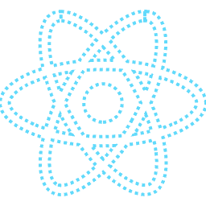
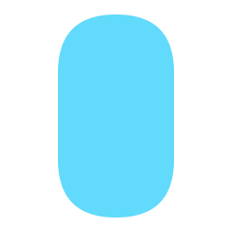

## Discrete Path Effect

Creates an effect that breaks a path into segments of a certain length and randomly moves the endpoints away from the original path by a maximum deviation.

| Name      | Type         |  Description                                                  |
|:----------|:-------------|:--------------------------------------------------------------|
| length    | `number`     | length of the subsegments.                                    |
| deviation | `number`     | limit of the movement of the endpoints.                       |
| seed      | `number`     | modifies the randomness. See SkDiscretePathEffect.h for more. |
| children? | `PathEffect` | Optional path effect to apply.                                |


### Example

```tsx twoslash
import {Canvas, Paint, DiscretePathEffect, Path} from "@shopify/react-native-skia";

const logo = "M256 128.015C256 111.057 234.762...";

const Discrete = () => {
  return (
    <Canvas style={{ flex: 1 }}>
      <Paint>
        <DiscretePathEffect length={10} deviation={2} />
      </Paint>
      <Path path={logo} color="#61DAFB" />
    </Canvas>
  );
};
```

### Result


## Dash Path Effect

Creates an effect that adds dashes to the path.


| Name      | Type         |  Description                                                  |
|:----------|:-------------|:--------------------------------------------------------------|
| intervals | `number[]`   | even number of entries with even indices specifying the length of the "on" intervals, and the odd indices specifying the length of "off". |
| phase     | `number`     | offset into the intervals array. Defaults to 0.        |
| children? | `PathEffect` | Optional path effect to apply.                                |

### Example

```tsx twoslash
import {Canvas, Paint, DashPathEffect, Path} from "@shopify/react-native-skia";

const logo = "M256 128.015C256 111.057 234.762...";

const Discrete = () => {
  return (
    <Canvas style={{ flex: 1 }}>
      <Paint style="stroke" strokeWidth={4}>
        <DashPathEffect intervals={[4, 4]} />
      </Paint>
      <Path path={logo} color="#61DAFB" />
    </Canvas>
  );
};
```

### Result



## Corner Path Effect

Creates a path effect that can turn sharp corners into rounded corners.

| Name      | Type         |  Description                                                  |
|:----------|:-------------|:--------------------------------------------------------------|
| r         | `number`     | Radius.                                                       |
| children? | `PathEffect` | Optional path effect to apply.                                |

### Example

```tsx twoslash
import {Canvas, Paint, CornerPathEffect, Rect} from "@shopify/react-native-skia";


const Discrete = () => {
  return (
    <Canvas style={{ flex: 1 }}>
       <Paint>
        <CornerPathEffect r={64} />
      </Paint>
      <Rect
        x={64}
        y={16}
        width={128}
        height={256 - 16}
        color="#61DAFB"
      />
    </Canvas>
  );
};
```

### Result

