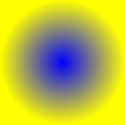
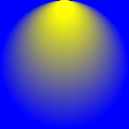

## Common Properties

Below are the properties common to all gradient components.

| Name       | Type           |  Description                    |
|:-----------|:---------------|:--------------------------------|
| colors     | `string[]`     | Colors to be distributed between start and end. |
| positions? | `number[]`     | The relative positions of colors. If supplied, it must be of the same length as colors. |
| mode?      | `TileMode`     | Can be `clamp`, `repeat`, `mirror`, or `decal`. |
| flags?     | `number`       | By default, gradients will interpolate their colors in unpremultiplied space and then premultiply each of the results. By setting this to 1, the gradients will premultiply their colors first and then interpolate between them. |
| transform? | `Transforms2d` | see [transformations](/docs/group#transformations). |

## Linear Gradient

Returns a shader that generates a linear gradient between the two specified points.

| Name       | Type           |  Description                    |
|:-----------|:---------------|:--------------------------------|
| start      | `Point`        | Start position of the gradient. |
| end        | `Point`        | End position of the gradient.   |

### Example
```tsx twoslash
import React from "react";
import {
  Canvas,
  Rect,
  LinearGradient,
  Skia,
  Shader,
  vec
} from "@shopify/react-native-skia";

export const LinearGradientDemo = () => {
  return (
    <Canvas style={{ flex: 1 }}>
      <Rect x={0} y={0} width={256} height={256}>
        <LinearGradient
          start={vec(0, 0)}
          end={vec(256, 256)}
          colors={["blue", "yellow"]}
        />
      </Rect>
    </Canvas>
  );
};
```
### Result


## Radial Gradient

Returns a shader that generates a radial gradient given the center and radius.

| Name       | Type           |  Description                    |
|:-----------|:---------------|:--------------------------------|
| c          | `Point`        | Center of the gradient. |
| r          | `number`       | Radius of the gradient.   |

### Example
```tsx twoslash
import React from "react";
import {
  Canvas,
  Rect,
  RadialGradient,
  Skia,
  Shader,
  vec
} from "@shopify/react-native-skia";

export const RadialGradientDemo = () => {
  return (
    <Canvas style={{ flex: 1 }}>
      <Rect x={0} y={0} width={256} height={256}>
        <RadialGradient
          c={vec(128, 128)}
          r={128}
          colors={["blue", "yellow"]}
        />
      </Rect>
    </Canvas>
  );
};
```
### Result


## Two Point Conical Gradient

Returns a shader that generates a conical gradient given two circles.

| Name       | Type           |  Description                    |
|:-----------|:---------------|:--------------------------------|
| start  | `Point`        | Center of the start circle. |
| startR | `number`       | Radius of the start circle. |
| end    | `number`       | Center of the end circle.   |
| endR          | `number`       | Radius of the end circle.   |

### Example
```tsx twoslash
import React from "react";
import {
  Canvas,
  Rect,
  TwoPointConicalGradient,
  Skia,
  Shader,
  vec
} from "@shopify/react-native-skia";

export const TwoPointConicalGradientDemo = () => {
  return (
    <Canvas style={{ flex: 1 }}>
      <Rect x={0} y={0} width={256} height={256}>
        <TwoPointConicalGradient
          start={vec(128, 128)}
          startR={128}
          end={vec(128, 16)}
          endR={16}
          colors={["blue", "yellow"]}
        />
      </Rect>
    </Canvas>
  );
};
```
### Result


## Sweep Gradient

Returns a shader that generates a sweep gradient given a center.

| Name       | Type           |  Description                    |
|:-----------|:---------------|:--------------------------------|
| c          | `Point`        | Center of the gradient          |
| start?     | `number`       | Start angle in degrees (default is 0). |
| end?     | `number`         | End angle in degrees (default is 360). |

### Example
```tsx twoslash
import React from "react";
import {
  Canvas,
  Rect,
  SweepGradient,
  Skia,
  Shader,
  vec
} from "@shopify/react-native-skia";

export const SweepGradientDemo = () => {
  return (
    <Canvas style={{ flex: 1 }}>
      <Rect x={0} y={0} width={256} height={256}>
        <SweepGradient
          c={vec(128, 128)}
          colors={["cyan", "magenta", "yellow", "cyan"]}
        />
      </Rect>
    </Canvas>
  );
};
```
### Result

