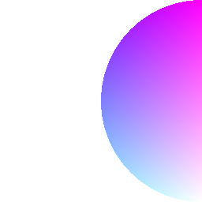

Skia provides a shading language.
You can play with it [here](https://shaders.skia.org/).
The syntax is very similar to GLSL.

The first step is to create a shader and compile it using `RuntimeEffect.Make`.

```tsx twoslash
import {Skia} from "@shopify/react-native-skia";

const source = Skia.RuntimeEffect.Make(`
vec4 main(vec2 pos) {
  vec2 normalized = pos/vec2(256.0, 256.0);
  return vec4(normalized.x, normalized.y, 0.5, 1);
}`);

if (!source) {
  throw new Error("Couldn't compile the shader")
}
```

## Shader

Creates a shader from source.
Shaders can be nested with one another.

| Name     | Type            |  Description                  |
|:---------|:----------------|:------------------------------|
| source   | `RuntimeEffect` | Compiled shaders              |
| uniforms | `number`        | uniform values                |
| children | `Shader`        | Shaders to be used as uniform |

### Simple Shader

```tsx twoslash
import {Skia, Canvas, Paint, Shader, Fill} from "@shopify/react-native-skia";

const source = Skia.RuntimeEffect.Make(`
vec4 main(vec2 pos) {
  vec2 normalized = pos/vec2(256);
  return vec4(normalized.x, normalized.y, 0.5, 1);
}`)!;

const SimpleShader = () => {
  return (
    <Canvas style={{ flex: 1 }}>
      <Paint>
        <Shader source={source} />
      </Paint>
      <Fill />
    </Canvas>
  );
};
```


### Using Uniforms

```tsx twoslash
import {Canvas, Skia, Paint, Shader, Fill} from "@shopify/react-native-skia";

const source = Skia.RuntimeEffect.Make(`
uniform float blue;
uniform float r;

vec4 main(vec2 pos) {
  vec2 normalized = pos/vec2(2 * r);
  return distance(pos, vec2(r)) > r ? vec4(1) : vec4(normalized.x, normalized.y, blue, 1);
}`)!;

const UniformShader = () => {
  const blue = 1.0;
  const r = 128;
  return (
    <Canvas style={{ flex: 1 }}>
      <Paint>
        <Shader source={source} uniforms={[blue, r]} />
      </Paint>
      <Fill />
    </Canvas>
  );
};
```



### Nested Shaders

```tsx twoslash
import {Canvas, Skia, ImageShader, Paint, Shader, Fill} from "@shopify/react-native-skia";

const source = Skia.RuntimeEffect.Make(`
uniform shader image;

half4 main(float2 xy) {   
  xy.x += sin(xy.y / 3) * 4;
  return image.eval(xy).rbga;
}`)!;

const NestedShader = () => {
  return (
    <Canvas style={{ flex: 1 }}>
      <Paint>
        <Shader source={source}>
          <ImageShader
            source={require("./assets/oslo.jpg")}
            fit="cover"
            fitRect={{ x: 0, y: 0, width: 256, height: 256 }}
          />
        </Shader>
      </Paint>
      <Fill />
    </Canvas>
  );
};
```

