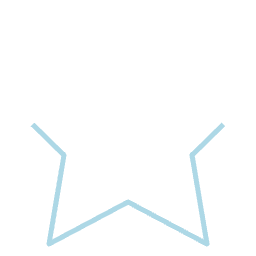

In Skia, paths are semantically identical to [SVG Paths](https://developer.mozilla.org/en-US/docs/Web/SVG/Tutorial/Paths).

| Name      | Type      |  Description                                                  |
|:----------|:----------|:--------------------------------------------------------------|
| path      | `IPath` or `string` | Path to draw. Can be a string using the [SVG Path notation](https://developer.mozilla.org/en-US/docs/Web/SVG/Tutorial/Paths#line_commands) or an object created with `Skia.Path.Make()`. |
| start     | `number` | Trims the start of the path. Value is in the range `[0, 1]` (default is 0). |
| end       | `number` | Trims the end of the path. Value is in the range `[0, 1]` (default is 1). |
| stroke    | `StrokeOptions` | Turns this path into the filled equivalent of the stroked path. This will fail if the path is a hairline. `StrokeOptions` describes how the stroked path should look. It contains three properties: `width`, `strokeMiterLimit` and, `precision` |

### Using SVG Notation

```tsx twoslash
import {Canvas, Path} from "@shopify/react-native-skia";

const SVGNotation = () => {
  return (
    <Canvas style={{ flex: 1 }}>
      <Path
        path="M 128 0 L 168 80 L 256 93 L 192 155 L 207 244 L 128 202 L 49 244 L 64 155 L 0 93 L 88 80 L 128 0 Z"
        color="lightblue"
      />
    </Canvas>
  );
};
```


### Using Path Object

```tsx twoslash
import {Canvas, Path, Skia} from "@shopify/react-native-skia";

const path = Skia.Path.Make();
path.moveTo(128, 0);
path.lineTo(168, 80);
path.lineTo(256, 93);
path.lineTo(192, 155);
path.lineTo(207, 244);
path.lineTo(128, 202);
path.lineTo(49, 244);
path.lineTo(64, 155);
path.lineTo(0, 93);
path.lineTo(88, 80);
path.lineTo(128, 0);
path.close();

const PathDemo = () => {
  return (
    <Canvas style={{ flex: 1 }}>
      <Path
        path={path}
        color="lightblue"
      />
    </Canvas>
  );
};
```


### Trim

```tsx twoslash
import {Canvas, Path} from "@shopify/react-native-skia";

const SVGNotation = () => {
  return (
    <Canvas style={{ flex: 1 }}>
      <Path
        path="M 128 0 L 168 80 L 256 93 L 192 155 L 207 244 L 128 202 L 49 244 L 64 155 L 0 93 L 88 80 L 128 0 Z"
        color="lightblue"
        style="stroke"
        strokeJoin="round"
        strokeWidth={5}
        // We trim the first and last quarter of the path
        start={0.25}
        end={0.75}
      />
    </Canvas>
  );
};
```


