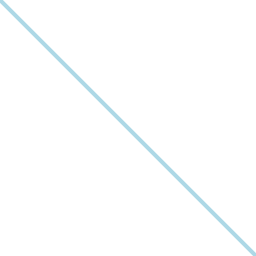

## Rect

Draws a rectangle.

| Name   | Type     | Description              |
| :----- | :------- | :----------------------- |
| x      | `number` | X coordinate.            |
| y      | `number` | Y coordinate.            |
| width  | `number` | Width of the rectangle.  |
| height | `number` | Height of the rectangle. |

```tsx twoslash
import { Canvas, Rect } from "@shopify/react-native-skia";

const RectDemo = () => {
  return (
    <Canvas style={{ flex: 1 }}>
      <Rect x={0} y={0} width={256} height={256} color="lightblue" />
    </Canvas>
  );
};
```

## RoundedRect

Draws a rounded rectangle.

| Name   | Type     | Description                                                   |
| :----- | :------- | :------------------------------------------------------------ |
| x      | `number` | X coordinate.                                                 |
| y      | `number` | Y coordinate.                                                 |
| width  | `number` | Width of the rectangle.                                       |
| height | `number` | Height of the rectangle.                                      |
| r?    | `number` or `Vector` | Corner radius. Defaults to `ry` if specified or 0. |

```tsx twoslash
import { Canvas, RoundedRect } from "@shopify/react-native-skia";

const RectDemo = () => {
  return (
    <Canvas style={{ flex: 1 }}>
      <RoundedRect
        x={0}
        y={0}
        width={256}
        height={256}
        r={25}
        color="lightblue"
      />
    </Canvas>
  );
};
```


### Using Custom Radii

You can set a different corner radius for each corner.

```tsx twoslash
import { Canvas, RoundedRect } from "@shopify/react-native-skia";

const RectDemo = () => {
  const size = 256;
  const r = size * 0.2;
  const rrct = {
    rect: { x: 0, y: 0, width: size, height: size },
    topLeft: { x: 0, y: 0 },
    topRight: { x: r, y: r },
    bottomRight: { x: 0, y: 0 },
    bottomLeft: { x: r, y: r },
  };
  return (
    <Canvas style={{ width: size, height: size }}>
      <RoundedRect
        rect={rrct}
        color="lightblue"
      />
    </Canvas>
  );
};
```


## DiffRect

Draws the difference between two rectangles.

| Name  | Type          | Description      |
| :---- | :------------ | :--------------- |
| outer | `RectOrRRect` | Outer rectangle. |
| inner | `RectOrRRect` | Inner rectangle. |

```tsx twoslash
import { Canvas, DiffRect, rect, rrect } from "@shopify/react-native-skia";

const DRectDemo = () => {
  const outer = rrect(rect(0, 0, 256, 256), 25, 25);
  const inner = rrect(rect(50, 50, 256 - 100, 256 - 100), 50, 50);
  return (
    <Canvas style={{ flex: 1 }}>
      <DiffRect inner={inner} outer={outer} color="lightblue" />
    </Canvas>
  );
};
```


## Line

Draws a line between two points.

| Name | Type    | Description  |
| :--- | :------ | :----------- |
| p1   | `Point` | Start point. |
| p2   | `Point` | End point.   |

```tsx twoslash
import { Canvas, Line, vec } from "@shopify/react-native-skia";

const LineDemo = () => {
  return (
    <Canvas style={{ flex: 1 }}>
      <Line
        p1={vec(0, 0)}
        p2={vec(256, 256)}
        color="lightblue"
        style="stroke"
        strokeWidth={4}
      />
    </Canvas>
  );
};
```



## Points

Draws points and optionally draws the connection between them.

| Name   | Type        | Description                                                                                                                                                |
| :----- | :---------- | :--------------------------------------------------------------------------------------------------------------------------------------------------------- |
| points | `Point`     | Points to draw.                                                                                                                                            |
| mode   | `PointMode` | How should the points be connected. Can be `points` (no connection), `lines` (connect pairs of points), or `polygon` (connect lines). Default is `points`. |

```tsx twoslash
import { Canvas, Points, vec } from "@shopify/react-native-skia";

const PointsDemo = () => {
  const points = [
    vec(128, 0),
    vec(168, 80),
    vec(256, 93),
    vec(192, 155),
    vec(207, 244),
    vec(128, 202),
    vec(49, 244),
    vec(64, 155),
    vec(0, 93),
    vec(88, 80),
    vec(128, 0),
  ];
  return (
    <Canvas style={{ flex: 1 }}>
      <Points
        points={points}
        mode="polygon"
        color="lightblue"
        style="stroke"
        strokeWidth={4}
      />
    </Canvas>
  );
};
```


